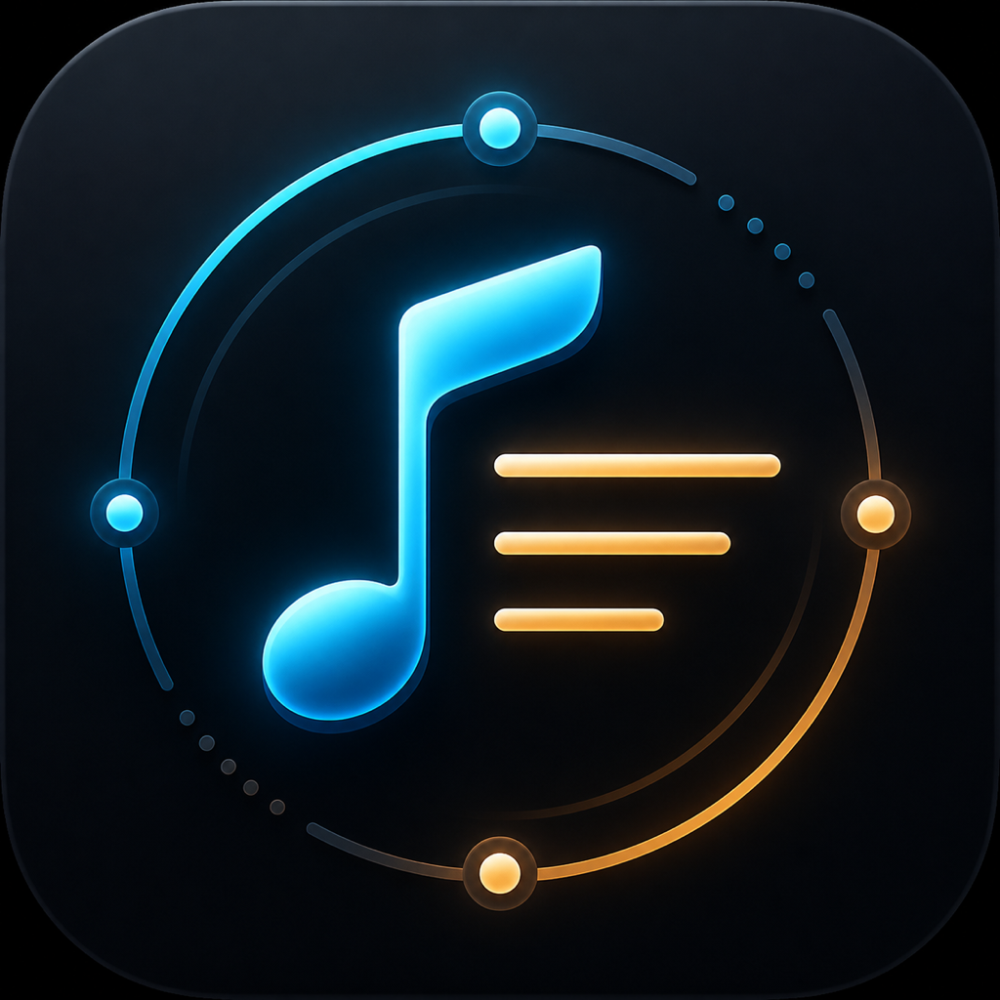

# Roon Lyric

Roon Lyric is a native macOS desktop lyric companion for Roon. It discovers Roon Core on the local network, subscribes to the active playback Zone, resolves lyrics, and shows a QQ Music-style floating lyric window on the desktop.

Roon Lyric 是一款原生 macOS 桌面歌词同步工具。它会在局域网内发现 Roon Core，订阅当前播放 Zone，解析歌曲歌词，并以类似 QQ 音乐桌面歌词的悬浮窗口展示当前歌词。



## Features / 功能

- Native SwiftUI/AppKit macOS app, packaged as a double-clickable `.app`.
- Automatic Roon Core discovery through Roon SOOD.
- Manual Roon Core host/IP and port fallback for NAS, Docker, or multicast-blocked networks.
- Roon extension registration, authorization, token persistence, and Zone subscription.
- Current track metadata: title, artist, album, duration, seek position, and playback state.
- Lyrics resolution with cache first, LRCLIB next, and optional user-configured official/authorized QQ Music endpoint.
- Spotify configuration is available for metadata matching only; Spotify Web API does not expose a public lyrics endpoint.
- Floating desktop lyric panel with configurable size, opacity, color, next-line preview, and drag position.
- Local runtime logs for troubleshooting.

- 原生 SwiftUI/AppKit macOS 应用，可打包为双击运行的 `.app`。
- 通过 Roon SOOD 自动发现 Roon Core。
- 当 NAS、Docker 或网络限制导致组播不可用时，支持手动输入 Roon Core host/IP 和端口。
- 支持 Roon 扩展注册、授权、token 持久化和 Zone 订阅。
- 展示当前曲目标题、艺人、专辑、时长、播放进度和播放状态。
- 歌词解析顺序为本地缓存、LRCLIB、可选的用户自配 QQ 音乐官方/授权接口。
- Spotify 仅用于元数据匹配配置；Spotify Web API 不提供公开歌词 endpoint。
- 桌面悬浮歌词支持字号、透明度、颜色、下一句预览和拖动位置。
- 本地运行日志便于问题定位。

## Requirements / 环境要求

- macOS 13 or later.
- Full Xcode installed at `/Applications/Xcode.app` for local builds.
- Roon Core reachable from the same LAN.
- Optional: Apple Developer ID Application certificate for signed release DMGs.
- Optional: GitHub CLI (`gh`) for repository bootstrap and release management.

- macOS 13 或更高版本。
- 本地构建建议安装完整 Xcode，并放在 `/Applications/Xcode.app`。
- Roon Core 需要能在同一局域网内访问。
- 可选：用于签名 release DMG 的 Apple Developer ID Application 证书。
- 可选：用于初始化 GitHub 仓库和发布 release 的 GitHub CLI (`gh`)。

## Build / 构建

```bash
DEVELOPER_DIR=/Applications/Xcode.app/Contents/Developer /usr/bin/swift build
DEVELOPER_DIR=/Applications/Xcode.app/Contents/Developer /usr/bin/swift test
```

Build and launch a local debug `.app`:

```bash
./script/build_and_run.sh --verify
```

构建并启动本地 debug `.app`：

```bash
./script/build_and_run.sh --verify
```

The staged app is written to:

```text
dist/RoonLyric.app
```

## Release DMG / 发布 DMG

Signed release builds require a Developer ID Application identity:

```bash
security find-identity -v -p codesigning
export DEVELOPER_ID_APPLICATION="Developer ID Application: Your Name (TEAMID)"
./script/package_release.sh --version 0.1.0
```

If no signing identity is available, create an unsigned local smoke-test DMG:

```bash
./script/package_release.sh --version 0.1.0 --allow-unsigned
```

The DMG output is written to:

```text
assets/releases/RoonLyric-0.1.0-macOS.dmg
```

如需签名 release 版本，需要先配置 Developer ID Application 证书：

```bash
security find-identity -v -p codesigning
export DEVELOPER_ID_APPLICATION="Developer ID Application: Your Name (TEAMID)"
./script/package_release.sh --version 0.1.0
```

如果当前机器没有签名证书，可以先生成未签名的本地验证 DMG：

```bash
./script/package_release.sh --version 0.1.0 --allow-unsigned
```

DMG 输出路径：

```text
assets/releases/RoonLyric-0.1.0-macOS.dmg
```

Copy `config/release.env.example` to `release.local.env` or export the variables in your shell. Do not commit certificates, passwords, tokens, or local keychains.

可以复制 `config/release.env.example` 为 `release.local.env`，或在 shell 中导出变量。不要提交证书、密码、token 或本地 keychain。

## GitHub Release / GitHub 发布

This repository includes `.github/workflows/release.yml`. Pushing a tag like `v0.1.0` builds a macOS DMG and uploads it to the GitHub Release assets.

Required secrets for signed CI builds:

- `DEVELOPER_ID_APPLICATION`
- `MACOS_CERTIFICATE_P12`
- `MACOS_CERTIFICATE_PASSWORD`
- `KEYCHAIN_PASSWORD`

Without signing secrets, CI can still build an unsigned DMG artifact for internal validation.

For local machines without GitHub CLI, the repository also includes a REST API fallback:

```bash
export GITHUB_TOKEN="github_pat_xxx"
./script/github_api_bootstrap.sh --repo OWNER/roon-lyric
./script/github_release_upload.sh \
  --repo OWNER/roon-lyric \
  --version 0.1.0 \
  --asset assets/releases/RoonLyric-0.1.0-macOS.dmg
```

项目包含 `.github/workflows/release.yml`。推送 `v0.1.0` 这样的 tag 后，GitHub Actions 会构建 macOS DMG，并上传到 GitHub Release assets。

签名 CI 构建需要配置以下 secrets：

- `DEVELOPER_ID_APPLICATION`
- `MACOS_CERTIFICATE_P12`
- `MACOS_CERTIFICATE_PASSWORD`
- `KEYCHAIN_PASSWORD`

未配置签名 secrets 时，CI 仍可产出未签名 DMG artifact，用于内部验证。

如果本机没有 GitHub CLI，也可以使用 GitHub REST API fallback：

```bash
export GITHUB_TOKEN="github_pat_xxx"
./script/github_api_bootstrap.sh --repo OWNER/roon-lyric
./script/github_release_upload.sh \
  --repo OWNER/roon-lyric \
  --version 0.1.0 \
  --asset assets/releases/RoonLyric-0.1.0-macOS.dmg
```

## GitHub Repository Bootstrap / GitHub 仓库初始化

After installing and authenticating GitHub CLI:

```bash
brew install gh
gh auth login
git config user.name "Your Name"
git config user.email "you@example.com"
./script/github_bootstrap.sh --repo OWNER/roon-lyric
```

If `gh` cannot be installed, use:

```bash
export GITHUB_TOKEN="github_pat_xxx"
git config user.name "Your Name"
git config user.email "you@example.com"
./script/github_api_bootstrap.sh --repo OWNER/roon-lyric
```

安装并登录 GitHub CLI 后：

```bash
brew install gh
gh auth login
git config user.name "Your Name"
git config user.email "you@example.com"
./script/github_bootstrap.sh --repo OWNER/roon-lyric
```

如果无法安装 `gh`，可以使用：

```bash
export GITHUB_TOKEN="github_pat_xxx"
git config user.name "Your Name"
git config user.email "you@example.com"
./script/github_api_bootstrap.sh --repo OWNER/roon-lyric
```

## Logs / 日志

Runtime logs are written to:

```text
~/Library/Application Support/RoonLyric/Logs/roon-lyric.log
```

The rotated previous log is:

```text
~/Library/Application Support/RoonLyric/Logs/roon-lyric.previous.log
```

运行日志路径：

```text
~/Library/Application Support/RoonLyric/Logs/roon-lyric.log
```

轮转后的上一个日志文件：

```text
~/Library/Application Support/RoonLyric/Logs/roon-lyric.previous.log
```

## Architecture / 架构

- `Sources/RoonLyric/App`: app lifecycle and shared model.
- `Sources/RoonLyric/Views`: SwiftUI main and settings UI.
- `Sources/RoonLyric/Services`: Roon discovery, MOO WebSocket, lyrics, sync, and desktop panel services.
- `Sources/RoonLyric/Stores`: persisted manual cores, tokens, lyrics cache, display preferences, and lyric provider settings.
- `Sources/RoonLyric/Models`: Roon, track, and lyric value models.
- `docs/product-design.md`: product scope, flows, UI, and acceptance criteria.
- `docs/technical-architecture.md`: protocol, module, persistence, logging, and packaging details.

## Current Limitations / 当前限制

- MVP supports macOS only.
- The app does not inspect or decode audio streams.
- QQ Music support requires a user-provided official or authorized endpoint; unofficial scraping is not shipped.
- Spotify support is limited to metadata matching configuration because the public Spotify Web API does not provide lyrics.
- Signed and notarized public distribution requires an Apple Developer account and local or CI certificate setup.

## License / 许可证

Roon Lyric is available under the MIT License. See [LICENSE](LICENSE).

Roon Lyric 使用 MIT License 开源。详见 [LICENSE](LICENSE)。
